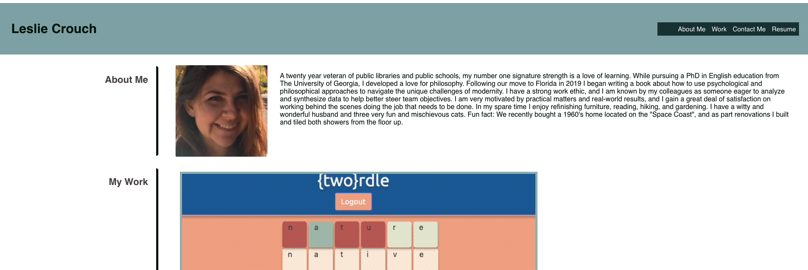
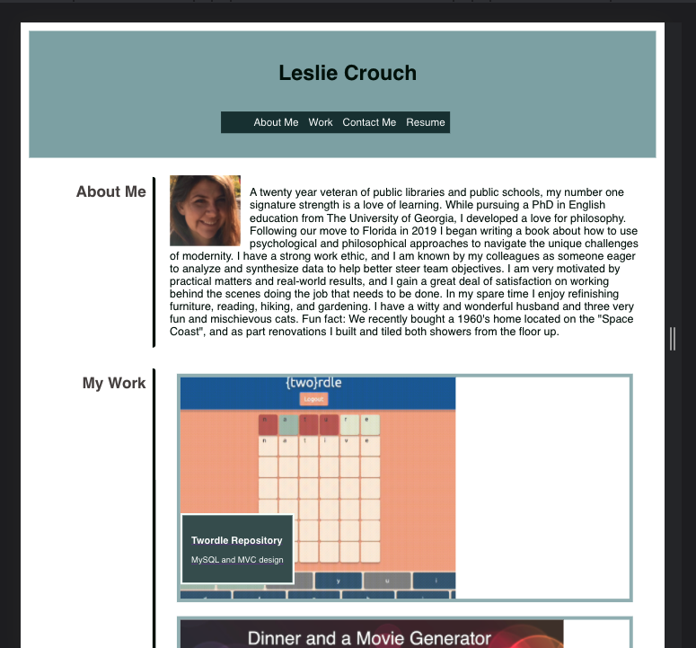

 # react-portfolio
 ##  
 ##  
  ## Licensing:
  
  ## Table of Contents: 
  - [Description](#description)
  - [Technology](#technology)
  - [Questions](#questions)

  ## Description:
  This is an updated version of my portfolio refactored as a React app with react components.   
  ## Technology:
  React.js
  ## License: 
  None Provided 
  ## Questions: 
  lmc@uga.edu
  
  <https://github.com/tripledawg>